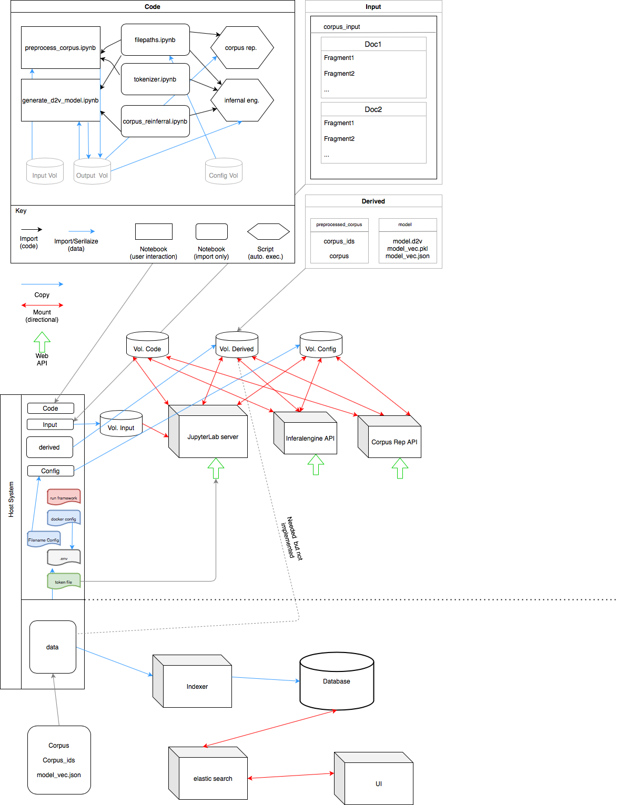

# evidence

Assisted close reading tool

| Five recommendations for fair software from [fair-software.nl](https://fair-software.nl) | Badges |
| --- | --- |
| 1. Code repository | [](https://github.com/ADAH-EviDENce/evidence/) |
| 2. License | [](https://github.com/ADAH-EviDENce/evidence/) |
| 3. Community registry | [](https://www.research-software.nl/software/evidence) |
| 4. Enable citation | [](https://doi.org/10.0000/FIXME) |
| 5. Checklist | N/A |
| **Other best practices** | |
| Markdown Link Checker| [](https://github.com/ADAH-EviDENce/evidence/actions?query=workflow%3A%22Check+Markdown+links%22) |
| docker-compose | [](https://github.com/ADAH-EviDENce/evidence/actions?query=workflow%3ADocker-compose) |

## Related repositories

[https://github.com/ADAH-EviDENce/EviDENce_doc2vec_docker_framework](https://github.com/ADAH-EviDENce/EviDENce_doc2vec_docker_framework)

[https://github.com/ADAH-EviDENce/evidence-gui](https://github.com/ADAH-EviDENce/evidence-gui)

## Generating a model from the corpus

Define the name of the dataset/experiment
```shell
export EXPERIMENT=getuigenverhalen
```

### Building the image

Be aware that building can take a couple of minutes.

Verify that your ``docker-compose`` version is at least 1.25.4

```
docker-compose --version
```

Verify that your ``docker`` version is at least 19.03.12

```
docker --version
```

```shell
# (starting from the repo root directory)
docker build --tag doc2vec model-generation/
```

### Running interactively

```shell
docker run -ti --volume ${PWD}/model-generation/notebooks:/data/notebooks \
               --volume ${PWD}/experiments/${EXPERIMENT}/corpus:/data/corpus \
               --volume ${PWD}/experiments/${EXPERIMENT}/model:/data/model \
               --user $(id -u):$(id -g) \
               doc2vec /bin/bash
```

### Running non-interactively

```shell
docker run --volume ${PWD}/model-generation/notebooks:/data/notebooks \
           --volume ${PWD}/experiments/${EXPERIMENT}/corpus:/data/corpus \
           --volume ${PWD}/experiments/${EXPERIMENT}/model:/data/model \
           --user $(id -u):$(id -g) \
           doc2vec
```

## Steps to get the frontend up and running

- Verify that your ``docker-compose`` version is at least 1.25.4
- Verify that your ``docker`` version is at least 19.03.12

```shell
# (starting from the repo root directory)
export EXPERIMENT=getuigenverhalen
docker-compose build
docker-compose up
```

Frontend should now be usable at [``http://localhost:8080``](http://localhost:8080).

> We strongly suggest not making the frontend available publicly as we do not have autentication. Anyone that knows the url may have an access to the frontend.
Running it on local network, for example university network, should be protected from most evil-doers.

## Frontend users

The first page of the frontend forces you to select a user or gebruiker in Dutch.
A user called `demo` exists and can be selected.

### Change initial user

The initial user in the frontend can be renamed by setting the `FRONTEND_USER` environment variable before running `docker-compose up`.

For example to have `myinitialusername` as user do the following

```shell
# (starting from the repo root directory)
export EXPERIMENT=getuigenverhalen
export FRONTEND_USER=myinitialusername
docker-compose up
```

### Add additional users

If the existing user is not enough, you can add a new user to the frontend with the following command:
(you can choose your own username by replacing `mynewusername` value in command)

```shell
export EXPERIMENT=getuigenverhalen
export FRONTEND_USER=mynewusername
docker-compose run usercreator
```

To add more users, repeat the command with different values for `FRONTEND_USER`.


## Diagram


